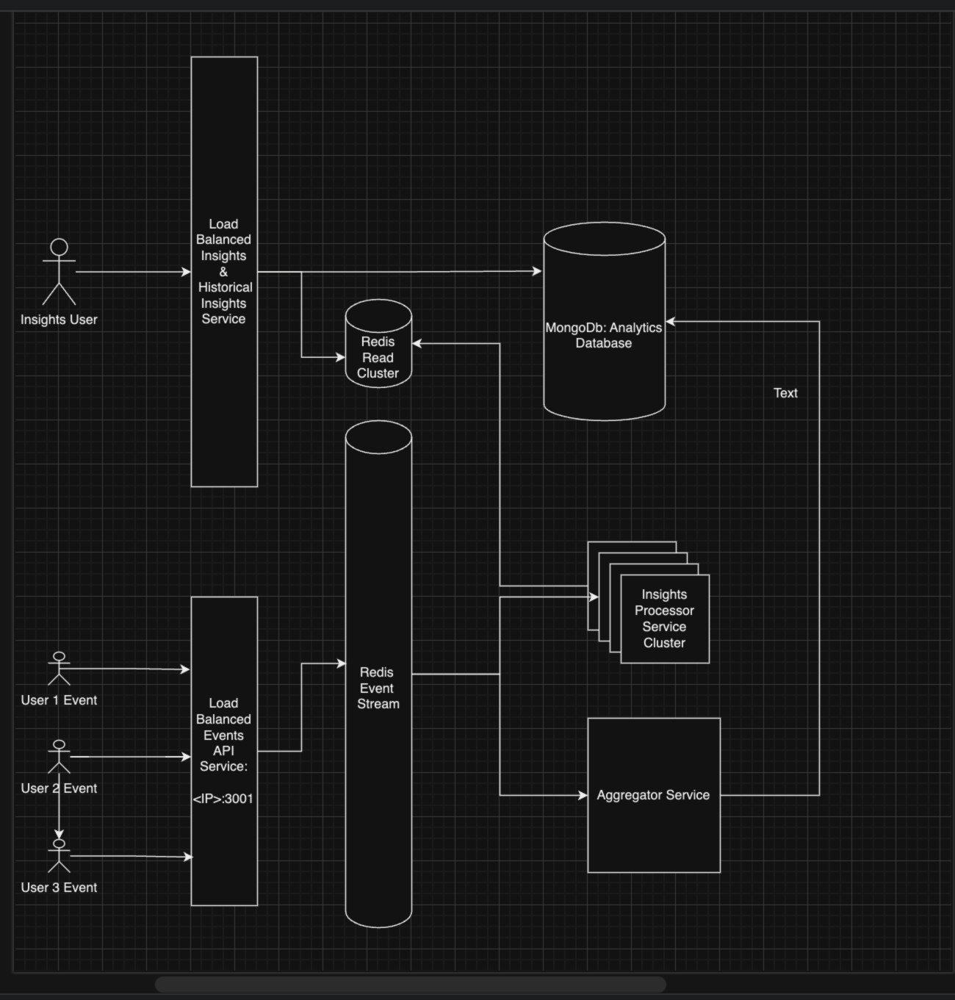

**Solution without using streams** branch: "without-stream" => https://github.com/ihave58/borneo-insights/tree/without-streams

**Solution with streams** branch: "main" => https://github.com/ihave58/borneo-insights/tree/main

- npm install;
- Set the respective .env file for Redis server.
- Open 3 terminals and run the below services independently:

  - npm run start:api-insights; (API server listens on http://localhost:3000) 
  - npm run start:event-ingestor; (Event ingestion service listens on http://localhost:3001) 
  - npm run start:insights-processor consumer1; (Event processor service) 
  - npm run start:insights-aggregator (Event aggregator service) 
  - npm run test; 

GET http://localhost:3000/api/insights 
POST http://localhost:3001/api/event  Event

